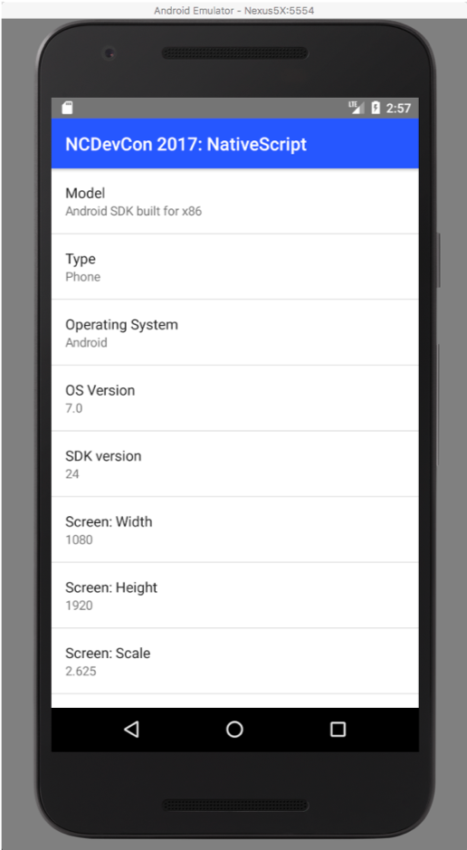

# NCDevCon 2017 Presentation: NativeScript Sample

This repository folder contains the source code for the NativeScript version of the sample application I demonstrated at NCDevCon 2017. The application uses the NativeScript APIs to retrieve data about the device running the application and displays it in a list in the application's main UI. 

***

You can find information on many different topics on my [personal blog](http://www.johnwargo.com). Learn about all of my publications at [John Wargo Books](http://www.johnwargobooks.com).